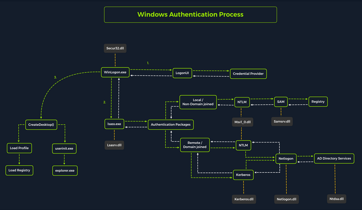

## Windows Authentication Process

### Windows Authentication Process Diagram

### LSA

- LSA stands for Local Security Authority.
- Authenticates local users, local logins and oversees all aspects of local security and provides services for translating between usernames and security identifiers(SIDs).
- Credentials are stored in `LSASS`, `SAM Database` or `Active Directory`.
- LSA is conceptual while LSASS is the actual implementation.

### LSASS

- Responsible for handling local security policy, authenticating users, and forwards security related events like logins, or failed logins etc. to `Event Log`.
- Located at `%SystemRoot%\System32\Lsass.exe`in the file system.

### WinLogon

- `WinLogon` handles the local logon process.
- The logon UI is handled by `logonUI`.

|**Authentication Packages**|**Description**|
|---|---|
|`Lsasrv.dll`|The LSA Server service both enforces security policies and acts as the security package manager for the LSA. The LSA contains the Negotiate function, which selects either the NTLM or Kerberos protocol after determining which protocol is to be successful.|
|`Msv1_0.dll`|Authentication package for local machine logons that don't require custom authentication.|
|`Samsrv.dll`|The Security Accounts Manager (SAM) stores local security accounts, enforces locally stored policies, and supports APIs.|
|`Kerberos.dll`|Security package loaded by the LSA for Kerberos-based authentication on a machine.|
|`Netlogon.dll`|Network-based logon service.|
|`Ntdsa.dll`|Directory System Agent (DSA) that manages the Active Directory database (ntds.dit), processes LDAP queries, and handles replication between domain controllers. Only loaded on Domain Controllers.|

### SAM Database

- Its a database in windows which stores user account credentials.
- It is used to authenticate both local and remote users and uses cryptographic protections to prevent unauthorized access.
- User passwords are stored as hashes in the registry, typically in the form of either `LM` or `NTLM` hashes.
- Located at `%SystemRoot%\system32\config\SAM` and is mounted under `HKLM\SAM`.

### NTDS

- `NTDS.dit` is a database file which stores Active Directory data. This data consists of the following stuff and more :-
	- user accounts (usernames and password hashes)
	- group accounts
	- computer accounts
	- group policy objects
- This `NTDS` is maintained by a Domain Controller in the Windows Domain network which is responsible to main authorization and authentication in this network. It controls the Active Directory forest. Each domain controller has a `NTDS.dit` file which is synchronized across all Domain Controllers. 

## Registry hives

There are three registry hives we can copy if we have local administrative access to a target system, each serving a specific purpose when it comes to dumping and cracking password hashes. A brief description of each is provided in the table below:

|Registry Hive|Description|
|---|---|
|`HKLM\SAM`|Contains password hashes for local user accounts. These hashes can be extracted and cracked to reveal plaintext passwords.|
|`HKLM\SYSTEM`|Stores the system boot key, which is used to encrypt the SAM database. This key is required to decrypt the hashes.|
|`HKLM\SECURITY`|Contains sensitive information used by the Local Security Authority (LSA), including cached domain credentials (DCC2), cleartext passwords, DPAPI keys, and more.|

## DCC2 hash

- local copies of network login hashes stored securely on a Windows computer.

## DPAPI

- DPAPI is a Windows mechanism built specifically to encrypt passwords and sensitive data safely.
- Below are just a few examples of applications that use DPAPI and how they use it:

|Applications|Use of DPAPI|
|---|---|
|`Internet Explorer`|Password form auto-completion data (username and password for saved sites).|
|`Google Chrome`|Password form auto-completion data (username and password for saved sites).|
|`Outlook`|Passwords for email accounts.|
|`Remote Desktop Connection`|Saved credentials for connections to remote machines.|
|`Credential Manager`|Saved credentials for accessing shared resources, joining Wireless networks, VPNs and more.|
- DPAPI encrypted credentials can be decrypted manually with tools like Impacket's [dpapi](https://github.com/fortra/impacket/blob/master/examples/dpapi.py), [mimikatz](https://github.com/gentilkiwi/mimikatz), or remotely with [DonPAPI](https://github.com/login-securite/DonPAPI).

